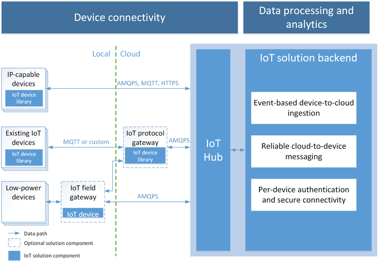

# 软件包介绍

**Azure** 是 RT-Thread 移植的用于连接微软  Azure IoT 中心的软件包，原始 SDK 为： [**azure-iot-sdk-c**](https://github.com/Azure/azure-iot-sdk-c/tree/5299d0010226fdf2dabb3ac3c1f38eabe4500986)。通过该软件包，可以让运行 RT-Thread 的设备轻松接入 Azure IoT 中心。

Azure IoT 中心的服务托管在云中运行，充当中央消息中心，用于 IoT 应用程序与其管理的设备之间的双向通信。 通过 Azure IoT 中心，可以在数百万 IoT 设备和云托管解决方案后端之间建立可靠又安全的通信，生成 IoT 解决方案。几乎可以将任何设备连接到 IoT 中心。

使用 Azure 软件包连接 IoT 中心可以实现如下功能：

- 轻松连入 Azure IoT 中心，建立与 Azure IoT 的可靠通讯

- 为每个连接的设备设置标识和凭据，并帮助保持云到设备和设备到云消息的保密性
- 管理员可在云端大规模地远程维护、更新和管理 IoT 设备

- 从设备大规模接收遥测数据
- 将数据从设备路由到流事件处理器
- 从设备接收文件上传
- 将云到设备的消息发送到特定设备

可以使用 Azure IoT 中心来实现自己的解决方案后端。 此外，IoT 中心还包含标识注册表，可用于预配设备、其安全凭据以及其连接到 IoT 中心的权限。

## 软件包目录结构

``` 
azure
├───azure                             // Azure 云平台 SDK
├───azure-port                        // 移植文件
├───docs 
│     └───figures                     // 文档使用图片
│     │   api.md                      // API 使用说明
│     │   introduction.md             // 介绍文档
│     │   principle.md                // 实现原理
│     │   README.md                   // 文档结构说明  
│     │   samples.md                  // 软件包示例
│     │   user-guide.md               // 使用说明
│     └───version.md                  // 版本
├───samples                           // 示例代码
│     │   iothub_ll_telemetry_sample  // 设备上传遥测数据示例
│     └───iothub_ll_c2d_sample        // 设备接收云端数据示例
│   LICENSE                           // 软件包许可证
│   README.md                         // 软件包使用说明
└───SConscript                        // RT-Thread 默认的构建脚本
```

## Azure 简述

微软云在中国区由世纪互联代理提供中国内的服务，国际版的微软云提供全球的服务。世纪互联本土运营的 Microsoft Azure 为不同需求的组织和个人提供了涵盖基础架构、数据库、Web 应用、人工智能、物联网等领域的全面云能力，充分满足了不同行业、不同规模、不同 IT 水平用户的多样化业务需求。

由世纪互联运营的 Microsoft Azure 是第一个在中国正式商用，符合中国政府相关法规要求的国际化公有云服务。该服务由在中国获得公有云业务许可的中国公司世纪互联负责运营，相比其他落地中国的国际公有云服务商，Azure 有一些醒目的优势：稳定高可用，可提供高达95% 的服务级别协议保障。

由世纪互联运营的 Microsoft Azure 使用位于中国，物理隔离的云服务实例，这些服务采用了微软服务于全球的 Azure 技术，能为客户提供全球一致的服务质量保障。在物联网领域，主要使用微软云的 Azure IoT 中心来完成设备的云连接需求。

## 功能介绍

Azure IoT 中心的架构图如下所示：

 

Azure IoT 中心提供如下功能：

- 与数百万 IoT 设备建立双向通信

依靠 Azure IoT 中心可以轻松安全地连接物联网 (IoT) 资产。在云到设备消息中，可靠地向连接的设备发送命令和通知，并通过确认回执跟踪消息传递。通过持久的方法发送设备消息，以适应间歇性连接的设备。

- 平台与协议

使用适用于多个平台（包括 Linux、Windows 和实时操作系统）的开放源代码设备 SDK 添加新设备并连接现有设备。使用标准协议和自定义协议，包括 **MQTT v3.1.1、HTTPS 1.1 或 AMQP 1.0 协议** 。

- [物联网安全性](https://docs.azure.cn/zh-cn/iot-hub/iot-hub-security-ground-up)

为每个连接的设备设置标识和凭据，并帮助保持云到设备和设备到云消息的保密性。要保持系统的完整性，请根据需要选择性地撤消特定设备的访问权限。 可以为每个设备设置独有的 [安全密钥](https://docs.azure.cn/zh-cn/iot-hub/iot-hub-devguide-security)，让它连接到 IoT 中心。 [IoT 中心标识注册表](https://docs.azure.cn/zh-cn/iot-hub/iot-hub-devguide-identity-registry) 会在解决方案中存储设备标识和密钥。 解决方案后端可将单个设备添加到允许或拒绝列表，以便完全掌控设备访问权限。 

其他连接安全功能包括：

    - 设备和 Azure IoT 中心之间，或网关和 Azure IoT 中心之间的通信路径，将配合使用 X.509 协议身份验证的 Azure IoT 中心使用行业标准的传输层安全 (TLS) 来保护。
    
    - 为了保护设备以防止来路不明的入站连接，Azure IoT 中心不会打开任何设备的连接。 设备将发起所有连接。
    
    - Azure IoT 中心永久存储设备的消息，并等待连接设备。 这些命令存储两天，使设备能够基于电源或连接因素偶而进行连接来接收这些命令。 Azure IoT 中心维护每个设备的设备队列。

- 通过设备管理，大规模管理 IoT 设备

借助 Azure IoT 中心新的设备管理功能，管理员可在云端大规模地远程维护、更新和管理 IoT 设备。设备孪生：可以使用设备孪生存储、同步和查询设备元数据和状态信息。 设备孪生是存储设备状态信息（例如元数据、配置和条件）的 JSON 文档。 IoT 中心为连接到 IoT 中心的每台设备维护一个设备孪生，设备数量可以达到数百万的规模。

- 通过 Azure IoT 网关 SDK 利用边缘智能

IoT 网关 SDK 提供强大的框架来生成、配置和部署边缘逻辑，从而让你能够使用 Azure IoT 做更多的事。

## 平台和硬件兼容性

对接入 Azure IoT 中心的设备平台要求如下：

- 能够建立 IP 连接：只有支持IP的设备才能与 Azure IoT 中心直接通信
- 支持TLS：与 Azure IoT 中心建立安全通信通道所需
- 支持SHA-256（可选）：生成用于使用服务验证设备的安全令牌所必需的。 可以使用不同的身份验证方法，并非全部都需要SHA-256
- 有一个实时时钟或实现代码连接到 NTP 服务器：建立 TLS 连接和生成安全令牌进行身份验证所必需的
- 拥有至少 64KB 的 RAM：SDK 的内存占用量取决于所使用的 SDK 和协议以及目标平台。 针对微控制器实现了最小的空间占用
